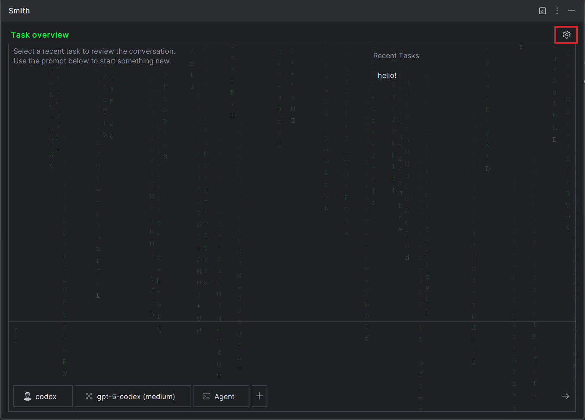
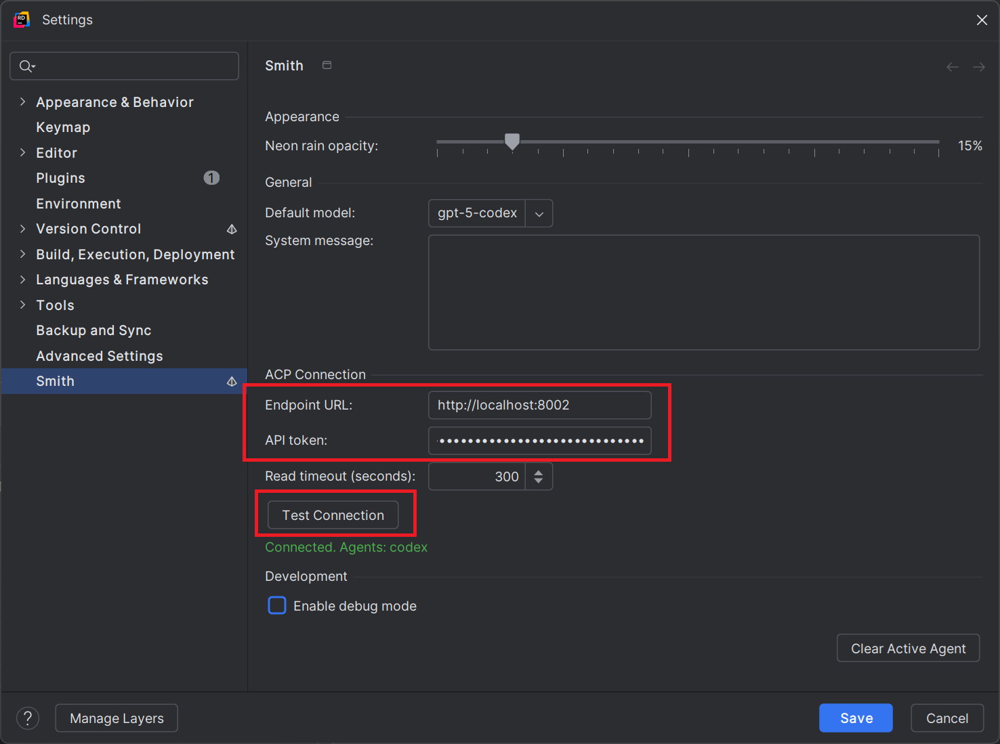
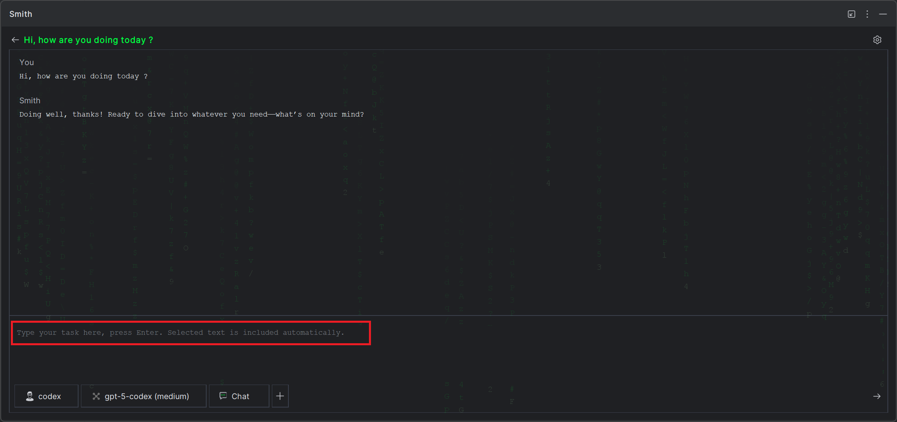

# Smith Plugin

Smith is a Mostly Harmless Tools project that streamlines everyday IntelliJ-based workflows with context-aware automation and quick access to ACP agents.

## Highlights
- One-click Smith tool window with curated agent shortcuts.
- Configurable project settings stored per workspace.
- Seamless integration with IntelliJ Platform IDEs.

## Installation
1. Currently only the codex agent is supported
    - [**Option 1**] Use the ACP agent's service on docker compose [docker-compose.yml](https://github.com/brunoamancio/smith-plugin/blob/main/docker-compose.yml) file. Run it with `docker compose up -d`
    - [**Option 2**] Install and run the codex agent acp (https://hub.docker.com/r/th3b0yr0x/smith-codex-acp).
      - `/path/to/workdir` is the path the agent should have access to (path to your code's root directory, for example).
      - `/path/to/codex/config` is the path you keep your codex config.toml file. 

      ```bash
      docker run -p 8002:8080 -v /path/to/workdir:/workspace -v /path/to/codex/config:/app/codex-config th3b0yr0x/smith-codex-acp:latest
      ```
    - Here is a suggested codex [config.toml](https://github.com/brunoamancio/smith-plugin/blob/main/docs/codex/config.toml)
1. Download Smith from the [JetBrains Marketplace](https://plugins.jetbrains.com/plugin/29005-smith).
1. Restart the IDE and open the Smith tool window on the right side panel.
1. Open Smith on your IDE, click on the settings button.

   

1. Set the ACP endpoint, for example, to agent in the docker container `http://localhost:8002`, set the API Token to your Open AI API key. Click on the "Test Connection" button. It should detect your agent. Save your settings.

   

1. Talk to Smith!

   

## Licensing
- Plugin ID: `com.mostlyharmless.tools.smith`
- License: [Smith Plugin License Agreement](https://raw.githubusercontent.com/brunoamancio/smith-plugin/refs/heads/main/LICENSE.md)

## Support the Project
If Smith makes your day a little easier, consider fueling the next round of Mostly Harmless experiments:
- Buy Me a Coffee: https://buymeacoffee.com/mostly.harmless.tools
- GitHub Sponsors: https://github.com/sponsors/brunoamancio

## Feedback
Open issues or feature requests through the issues are on github.
